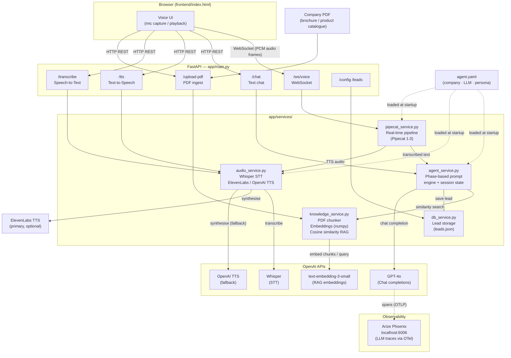

# Voice Sales Agent

An AI-powered multilingual voice sales agent built with FastAPI, OpenAI, and Pipecat. The agent handles real-time voice conversations with customers, understands Tamil/English (Tanglish) and other Indian languages, collects leads, and answers product queries from an uploaded company PDF.

---

## Features

- **Real-time voice** — WebSocket pipeline via Pipecat (Whisper STT + OpenAI TTS)
- **Multilingual** — Tamil, English, Hindi, Telugu, Kannada, Malayalam, and more (auto-detected)
- **RAG knowledge base** — upload a company PDF; the agent answers questions from it
- **Lead capture** — collects name, phone, and requirement; stored to `leads.json`
- **LLM tracing** — Arize Phoenix instruments every OpenAI call for observability
- **Configurable** — company info, persona, LLM settings all in `agent.yaml`

---

## Architecture



### Component Responsibilities

| Component | Role |
|-----------|------|
| `pipecat_service.py` | Full-duplex WebSocket voice pipeline — streams PCM from the browser, pipes through Whisper STT → agent → TTS and pushes audio back in real time |
| `agent_service.py` | Phase-based conversation engine (greeting → explore → recommend → collect → confirm → close); holds per-session state and builds dynamic system prompts |
| `audio_service.py` | Wraps Whisper for STT; wraps ElevenLabs (primary) and OpenAI TTS (fallback); caches filler audio; handles multilingual voice selection |
| `knowledge_service.py` | Ingests PDF text into overlapping chunks, embeds them with `text-embedding-3-small`, answers retrieval queries via cosine similarity (no vector DB dependency) |
| `db_service.py` | Reads/writes `leads.json`; one record per completed session |
| `main.py` | Mounts all routes; initialises Arize Phoenix + OpenTelemetry at startup so every OpenAI call is traced automatically |

### Data Flow — Voice Call

```
Mic audio (browser)
  → WebSocket /ws/voice
    → Pipecat pipeline
      → Whisper STT  →  transcribed text
        → AgentService (phase engine + RAG lookup)
          → GPT-4o  →  reply text
            → AudioService TTS (ElevenLabs / OpenAI)
              → PCM audio frames back over WebSocket
                → Browser speaker
```

---

## Project Structure

```
voiceagent/
├── agent.yaml                   # Company config, LLM settings, personality rules
├── leads.json                   # Persisted lead records
├── requirements.txt
├── app/
│   ├── main.py                  # FastAPI app, routes, Phoenix tracer init
│   └── services/
│       ├── agent_service.py     # Conversation logic, phase-based prompt engine
│       ├── audio_service.py     # Whisper STT + ElevenLabs/OpenAI TTS
│       ├── db_service.py        # Lead storage (JSON file)
│       ├── knowledge_service.py # PDF chunking + embedding (RAG)
│       └── pipecat_service.py   # Real-time WebSocket voice pipeline
└── frontend/
    └── index.html               # Browser UI
```

---

## Prerequisites

- Python 3.11+
- An OpenAI API key
- (Optional) ElevenLabs API key for higher-quality TTS

---

## Setup

### 1. Clone and create a virtual environment

```bash
git clone https://github.com/DeepakVijayasarathi/voiceagent.git
cd voiceagent
python -m venv .venv
# Windows
.venv\Scripts\activate
# macOS/Linux
source .venv/bin/activate
```

### 2. Install dependencies

```bash
python -m pip install -r requirements.txt
```

### 3. Configure environment variables

Create a `.env` file in the project root:

```env
OPENAI_API_KEY=sk-...
ELEVENLABS_API_KEY=...        # optional
```

### 4. (Optional) Edit agent.yaml

Customise company name, agent persona, LLM model, and conversation rules in `agent.yaml`.

---

## Running the App

```bash
uvicorn app.main:app --reload --port 8000
```

- Frontend UI: [http://localhost:8000](http://localhost:8000)
- API docs: [http://localhost:8000/docs](http://localhost:8000/docs)
- **Phoenix tracing UI**: printed in the console on startup (default [http://localhost:6006](http://localhost:6006))

---

## API Endpoints

| Method | Path | Description |
|--------|------|-------------|
| `POST` | `/upload-pdf` | Upload company brochure PDF to seed the knowledge base |
| `POST` | `/transcribe` | Transcribe an audio file (Whisper STT) |
| `POST` | `/tts` | Convert text to speech |
| `POST` | `/chat` | Text-based chat (non-voice) |
| `GET`  | `/config` | Returns current company info |
| `GET`  | `/leads` | Returns all captured leads |
| `DELETE` | `/session/{session_id}` | Clear a conversation session |
| `WS`   | `/ws/voice` | Real-time voice pipeline (Pipecat) |

---

## Tracing with Arize Phoenix

All OpenAI calls are automatically traced via [Arize Phoenix](https://phoenix.arize.com/).  
Phoenix starts alongside the app and its UI URL is printed to the console:

```
🌍 To access the Phoenix UI, open http://localhost:6006 in your browser
```

Open that URL to inspect:
- Every LLM call (prompt, response, latency, tokens)
- RAG retrieval spans
- Full conversation traces

No external account or API key is needed — Phoenix runs fully locally.

---

## Uploading a Company PDF

1. Open the frontend at [http://localhost:8000](http://localhost:8000)
2. Click **Upload PDF** and select your company brochure
3. The agent will extract company name, tagline, services, and location automatically
4. All subsequent conversations will use the PDF content for product Q&A

---

## Conversation Flow

The agent follows a phase-based conversation:

1. **Greeting** — warm introduction in the customer's detected language
2. **Explore** — understand the customer's requirement (up to 2 clarifying questions)
3. **Recommend** — suggest a product based on RAG knowledge
4. **Collect** — ask for name and phone number
5. **Confirm** — read back the details for confirmation
6. **Close** — save lead and end the call

---

## Leads

Captured leads are saved to `leads.json` and accessible via `GET /leads`.  
Each record includes: session ID, name, phone, requirement, budget, and timestamp.
